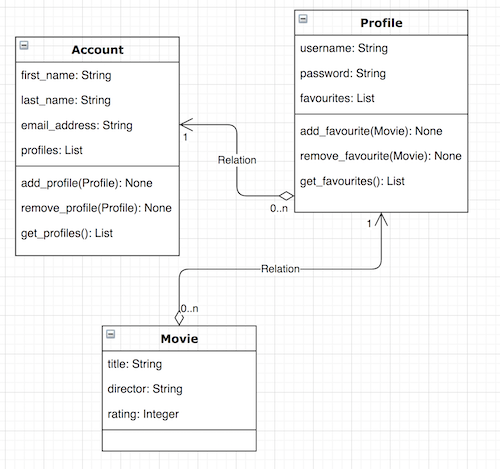

# OOP and TDD 

## Learning Objectives

- Translate a class diagram into code
- Practice TDD; Writing your tests first

Online streaming services such as Netflix often allow a user to add profiles to their account. Each profile will have a username, password and a list of favourite movies. A class diagram to represent this relationship might look like this:



The relationships between the classes in this case are what we call **one-to-many**. I.E. One account has many profiles and one profile has many accounts. An **Account** object has a list of **Profile** objects and a **Profile** object has a list of **Movie** objects.

The methods of the classes are also defined on the diagram. These include the argument type and return type. For example, the get_profiles() method takes no arguments and returns a List.

HINT: Make the assumption that an Account object and a Profile object will both initially have an empty list of profiles and favourites respectively.

Given the class diagram above, use TDD (write your tests first) to ensure the following:

- An Account can add a Profile
- An Account can remove a given Profile
- An Account can return a list of Profiles
- A Movie can be added to a Profile's favourites
- A given Movie can be removed from a Profile's favourites
- A Profile can return a list of Favourites

The start point contains some code to get you started.

## Running the tests

```python
# in the start_point directory
python3 run_tests.py
```

Initially you will get an error similar to this:

```bash
Traceback (most recent call last):
  File "run_tests.py", line 1, in <module>
    from tests.account_test import *
  File "/Users/user/week_06/homework/start_point/tests/account_test.py", line 2, in <module>
    from src.account import *
ModuleNotFoundError: No module named 'src.account'
```

This is good because it guides us and tells us our next step. This is the essence of TDD. Our first step then is to create an account.py file in the src directory and define the Account class in it.

Use the error messages to guide you! When you're finished you should have 6 passing tests.

## Extension Question

How would you update the diagram to accomodate a list of actors for a Movie? 
# I would just add something like `cast: List` to the top box (attributes) for the Movie class in the diagram.